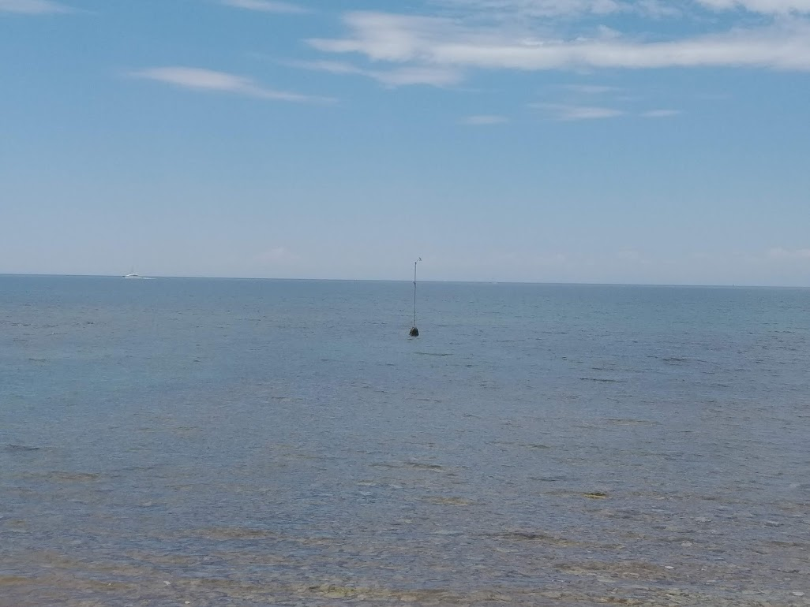
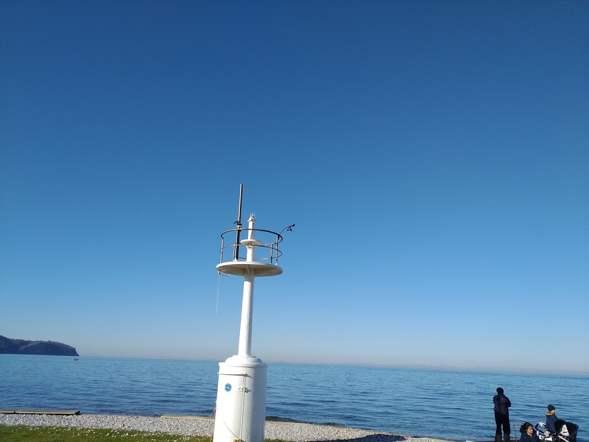

# Vetercek.com weather station
This project was created in order to provide cheap alternative to expensive autonomous weather stations. The goal is to create robust weather station that would require (almost) no maintenance. As mentioned in the title the data would be send to **vetercek.com** but with some modification other services could be included. Keep in mind that most attention is dedicated to measure wind since is used mostly by windsurfers, kiters and other wind enthusiast. In general we tried to keep the cost as low as possible on the other hand in some areas like for example anemometer we went with durable and well calibrated instead of cheap.

## Connecting options
+ [latest version with 7070 chip](vetercek_SIM7070) 
+ [old 7000 chip](vetercek_nb-iot-HW) 

### Field test
2.6.2019 we manage to set up our first weather station located in Sv. Ivan, Croatia. It was quite the challenge since the station is located in the sea about 30-40m from the shore.  
  
  
11.1.2020 we manage to set up new improved version of the station to lighthouse in Isola.  
  

## License
This project is released under
The GNU Lesser General Public License (LGPL-3.0)
