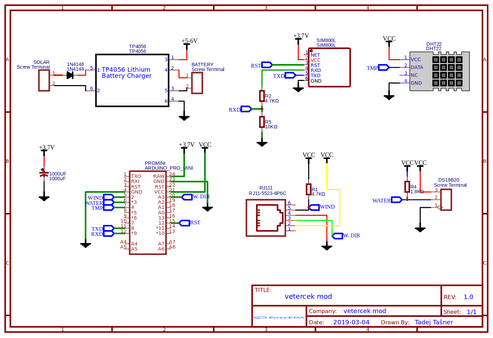

## Vetercek.com weather station
This project was created in order to provide cheap alternative to expensive autonomous weather stations. The goal is to create robust weather station that would require (almost) no maintenance. As mentioned in the title the data would be send to **vetercek.com** but with some modification other services could be included. Keep in mind that most attention is dedicated to measure wind since is used mostly by windsurfers, kiters and other wind enthusiast. In general we tried to keep the cost as low as possible on the other hand in some areas like for example anemometer we went with durable and well calibrated instead of cheap.

## Features of the WS
+ Send wind speed and gusts to the server
+ Send water and air temperature to the server
+ Send WS battery state to the server
+ Remote adjustment of the time between updates (depending on sever response)
+ Remote adjustment of wind wane offset (depending on sever response)
+ Wind speed and direction are measured for 1 second every ten seconds. While this will not detect winds under 2KT it is a good compromise for battery life

## Required parts
+ Arduino pro mini 3.3V **3€**
  + LED is removed to save battery life
+ Davis 6410 anemometer **150€**
+ Sim800l gsm module **4€**
  + LED is removed to save battery life
+ DHT22 temperature sensor **3€**
+ DS18B20 water temperature sensor **4€**
+ TP4056 li-ion charger **1€**
+ 5 or 6V Monocrystalline Solar Power Panel **10€**
+ 3.6V li-ion batteries **10-15€**
  +2-3 batteries with paralel connection
+ Waterproof housing
+ Some minor electrical parts like resistors, capacitors, diodes...
  + R1 = 4.7KΩ resistor
  + R2 = 4.7KΩ resistor
  + R4 = 1.8KΩ resistor
  + R5 = 10KΩ resistor
  + D1 = 1N4148 diode
  + C3 = 1000uF capacitor

## Scheme

Most parts are standard but RJ11 jack is a bit tricky. There are few wariants aveliable. Im using one with part number [5523](http://en.glgnet.biz/productsdetail/productId=97.html) printed on it. Connection should look like this on PCB  
  
Here is the [link](https://easyeda.com/jaka87/vetercek-mod) to PCB design.  

## TO-DO
+  ~~create PCB and make larger test outside~~
+ ~~allow for larger ints in order to have possibility for longer time between updates~~
+ support for wifi module
+ support for other web services
+ sending GPS cordinates to server (in case WS get stolen)

## Thanks!
Thanks to all of you contributing to make this happen. Especially thanks to Tadej Tašner for drawing PCB and his advices regarding the hardware components. Also thanks to those people that took time and wrote libraries used in this project and therefore make the project easier to compile.

Contributing to this software is warmly welcomed. You can use it, change it, do what ever you want with it.

## License
This project is released under
The GNU Lesser General Public License (LGPL-3.0)