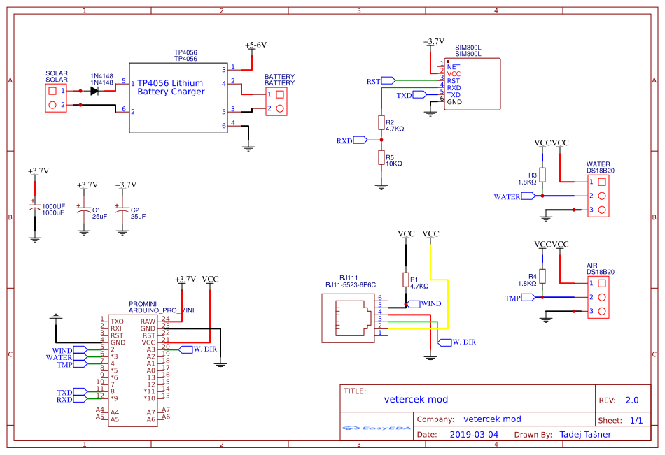
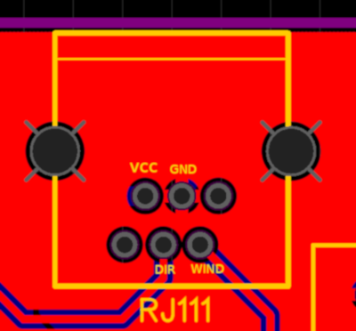
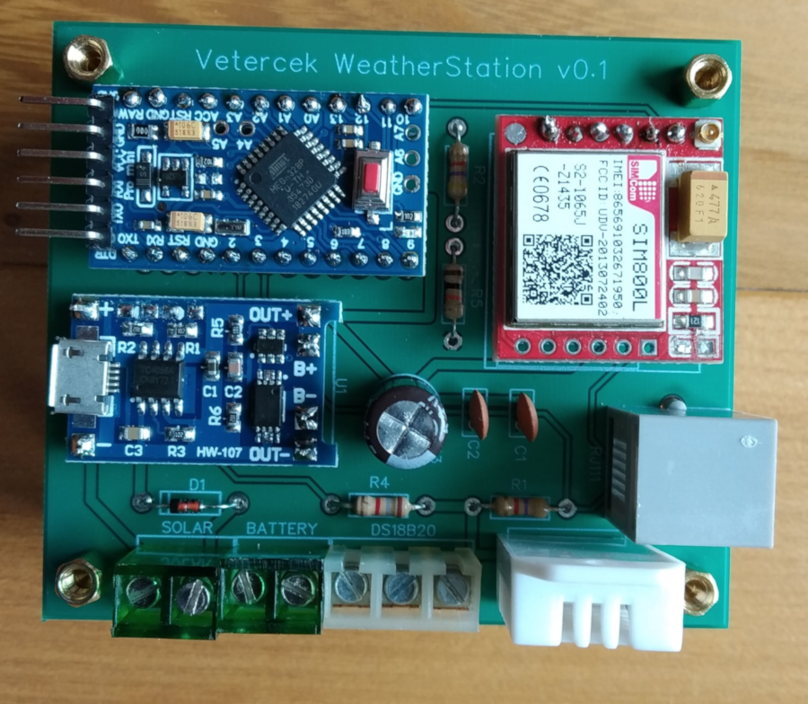

## Vetercek.com weather station 2G

## Required parts
+ Arduino pro mini 3.3V **3€**
  + LED is removed to save battery life
+ Davis 6410 anemometer **150€**
+ Sim800l gsm module **4€**
  + LED is removed to save battery life
+ ~~DHT22 temperature sensor **3€**~~ replaced by another DS18B20 mounted outside of housing
+ DS18B20 water temperature sensor **4€**
+ TP4056 li-ion charger **1€**
+ 5 or 6V Monocrystalline Solar Power Panel **5-10€**
+ 3.6V li-ion batteries **10-15€**
  +2-3 batteries with paralel connection
+ Waterproof housing
+ Some minor electrical parts like resistors, capacitors, diodes...
  + R1 = 4.7KΩ resistor
  + R2 = 4.7KΩ resistor
  + R4 = 1.8KΩ resistor
  + R5 = 10KΩ resistor
  + D1 = 1N4148 diode
  + C1 = 22nF capacitor
  + C2 = 22nF capacitor
  + C3 = 1000uF capacitor
  + 2x 2p screw in terminals
  + 3p screw in terminal
  + RJ11 connector to PCB
  + 2 cable glands for anemometer cable, and temperature sensor
  + PG11 cable gland with tyvek foil coverig the exit functioning as an air vent

## Scheme

Most parts are standard but RJ11 jack is a bit tricky. There are few wariants aveliable. Im using one with part number [5523](http://en.glgnet.biz/productsdetail/productId=97.html) printed on it. Connection should look like this on PCB  
  
Here is the [link](https://easyeda.com/jaka87/vetercek-mod) to PCB design.  

This is how  PCB looks with all components soldered together  
  

## TO-DO
+  ~~create PCB and make larger test outside~~
+ ~~allow for larger ints in order to have possibility for longer time between updates~~
+ ~~sending GPS cordinates to server (in case WS get stolen)~~
+ support for other web services - long term goal, not planned for near future

## Libraries used in this project
+ [ArduinoSIM800L](https://github.com/carrascoacd/ArduinoSIM800L) - send data to the server
+ [Sleep_n0m1](https://github.com/n0m1/Sleep_n0m1) - enable sleep to save battery
+ [OneWire](https://github.com/PaulStoffregen/OneWire) - manipulate DS18B20 sensor
+ [Arduino-Temperature-Control-Library](https://github.com/milesburton/Arduino-Temperature-Control-Library) - also manipulate DS18B20 sensor
+ [ArduinoJson](https://github.com/bblanchon/ArduinoJson) - parse JSON data

## Thanks!
Thanks to all of you contributing to make this happen. Especially thanks to Tadej Tašner for drawing PCB and his advices regarding the hardware components. Also thanks to those people that took time and wrote libraries used in this project and therefore make the project easier to compile.

Contributing to this software is warmly welcomed. You can use it, change it, do what ever you want with it.

## License
This project is released under
The GNU Lesser General Public License (LGPL-3.0)
