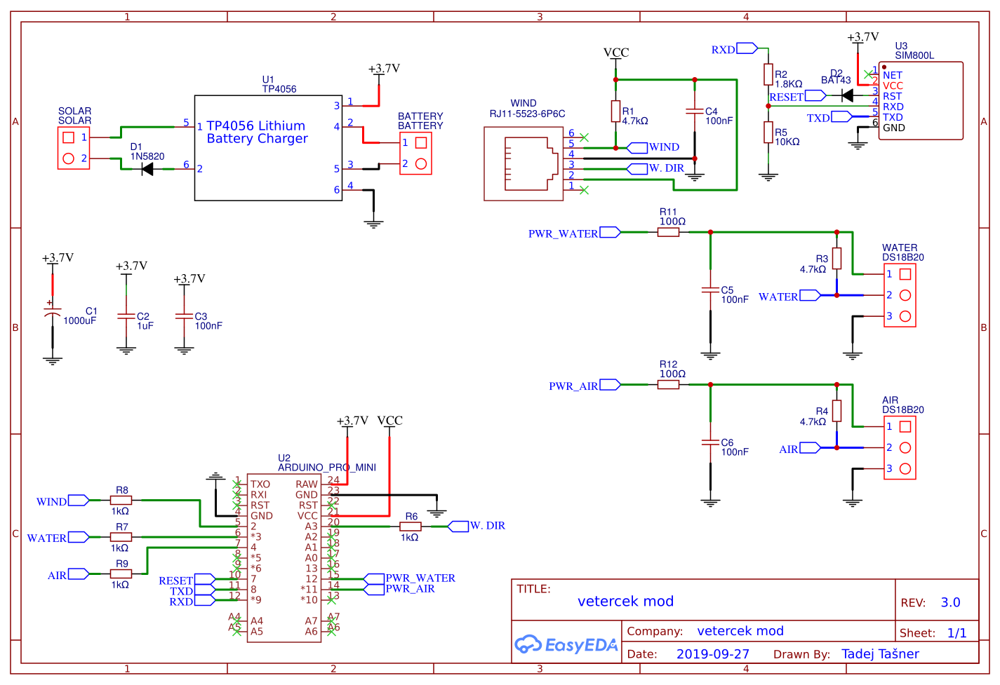
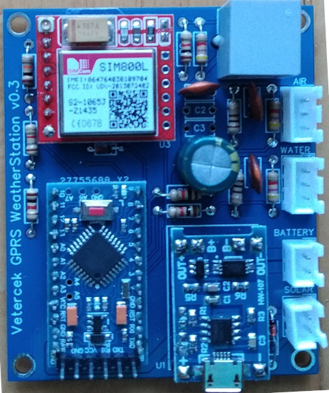
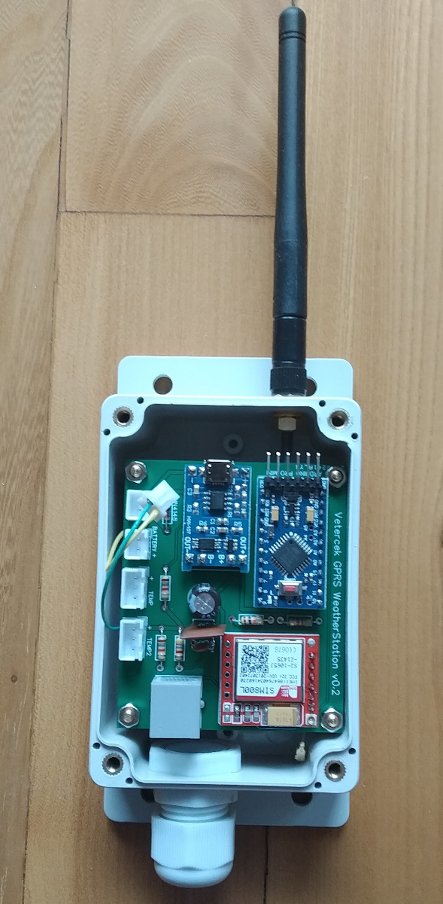

# Vetercek.com weather station 2G

## Features of the WS
+ Send wind speed and gusts to the server
+ Send water and air temperature to the server
+ Send WS battery state to the server
+ Remote adjustment of the time between updates (depending on sever response)
+ Remote adjustment of wind wane offset (depending on sever response)
+ Wind speed and direction are measured for 2 second every 10 seconds. It is a good compromise for accurate measurements and long battery life.

## Required parts
+ Arduino pro mini 3.3V **3€**
  + LED is removed to save battery life
+ Davis 6410 anemometer **150€**
+ Sim800l gsm module **4€**
  + LED is removed to save battery life
+ ~~DHT22 temperature sensor **3€**~~ replaced by another DS18B20 mounted outside of housing
+ DS18B20 water temperature sensor **4€**
+ TP4056 li-ion charger **1€**
+ 5 or 6V Monocrystalline Solar Power Panel **5-10€**
+ 3.6V li-ion batteries **10-15€**
  +2-3 batteries with paralel connection
+ Waterproof housing **5€**
+ GSM antena **3€**
+ Some minor electrical parts like resistors, capacitors, diodes... **5€**
+ RJ11 connector to PCB **1€**
+ 2 cable glands for anemometer cable, and temperature sensor **2€**

## Arduino pro mini
Arduino pro mini has different bootloader than Uno (older) that has watchdog bug that puts your arduino in endless loop even thou my script don't use watchdog directly. It took me months to figure it out. Station was working fine on good weather but reseted when there were storms whithc cause bad signal. After 1-10 resets this error apeared and manual intervention has to be done. I (fingers crossed) solved this with uploading with programmer (skipping bootloader). If you wish to use bootloader i suggest Minicore. Optiboot should also fix this issue, but i had trouble uploading sketches with it.

## Scheme
  
Here is the [link](https://easyeda.com/jaka87/vetercek-mod) to PCB design.  

Here it is new v0.3 PCB with some extra resistors, to turn power on/off from tmp sensors, and protect the board in case of tmp sensor short ciruit  
  

Here are v0.2 and v0.1 versions of PCB
  

Both v0.2 and v0.3 fits inside the 100x68x50mm box with the two or three 18650 batteries under PCB  
  

## TO-DO
+  ~~create PCB and make larger test outside~~
+ ~~allow for larger ints in order to have possibility for longer time between updates~~
+ ~~sending GPS cordinates to server (in case WS get stolen)~~
+ support for other web services - long term goal, not planned for near future

## Libraries used in this project
+ [ArduinoSIM800L](https://github.com/carrascoacd/ArduinoSIM800L) - send data to the server
+ [Low-Power](https://github.com/rocketscream/Low-Power) - enable sleep to save battery
+ [OneWire](https://github.com/PaulStoffregen/OneWire) - manipulate DS18B20 sensor
+ [Arduino-Temperature-Control-Library](https://github.com/milesburton/Arduino-Temperature-Control-Library) - also manipulate DS18B20 sensor
+ [ArduinoJson](https://github.com/bblanchon/ArduinoJson) - parse JSON data

## Power consumption
|   |      Sleep     |  Running |
|----------|:-------------:|------:|
| arduino |  0.57mA | 4.17mA |
| anemometer |  0.18mA | 0.18mA |
| DS18B20 |  0.04mA | 0.04mA |
| sim800l |  2mA | 20-100mA |
| SUM |  ? | ? |

## Thanks!
Thanks to all of you contributing to make this happen. Especially thanks to Tadej Tašner for drawing PCB and his advices regarding the hardware components. Also thanks to those people that took time and wrote libraries used in this project and therefore make the project easier to compile.

Contributing to this software is warmly welcomed. You can use it, change it, do what ever you want with it.

## License
This project is released under
The GNU Lesser General Public License (LGPL-3.0)
