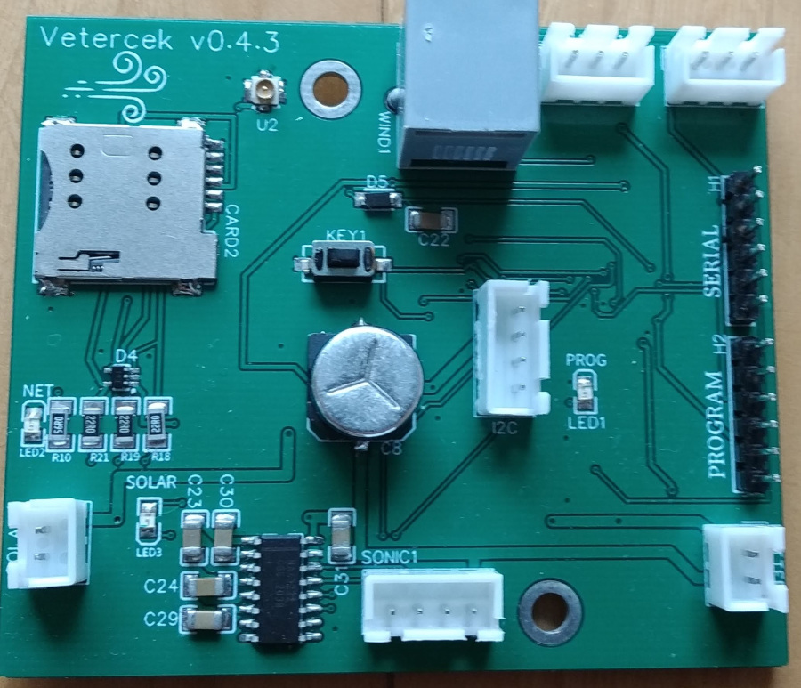
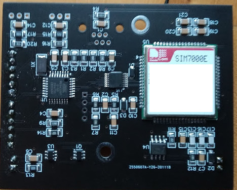
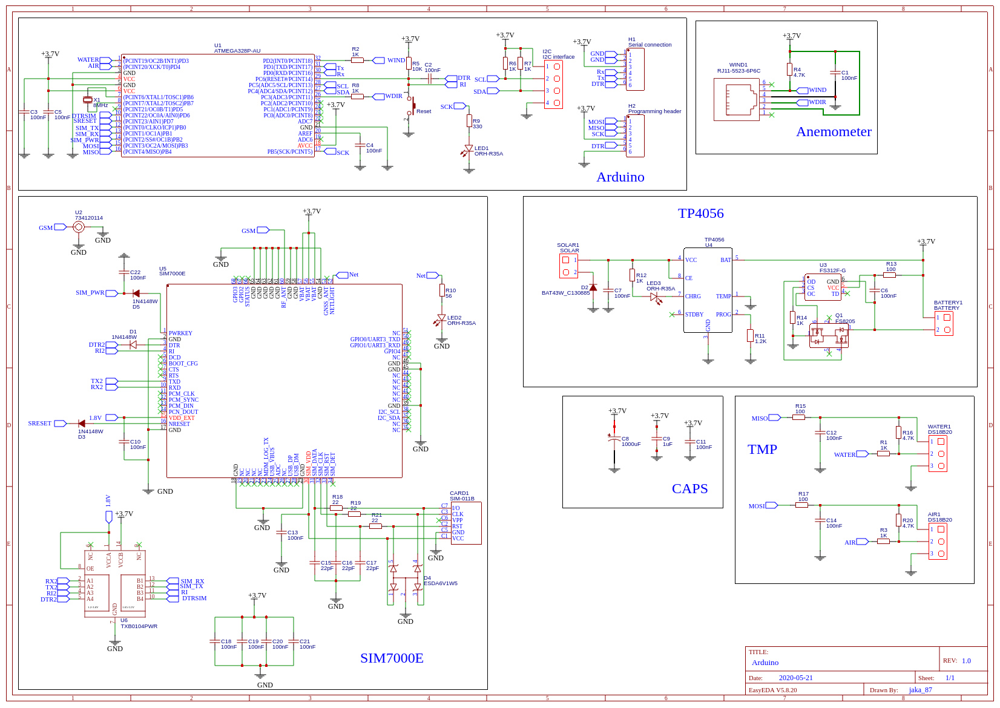

# Vetercek.com weather station nb-iot
New PCB  
    

## Features of the WS
+ Send wind speed and gusts to the server
+ Send water and air temperature to the server
+ Send WS battery state to the server
+ Remote adjustment of the time between updates (depending on sever response)
+ Remote adjustment of wind wane offset (depending on sever response)
+ Wind speed and direction are measured for 2 second every 10 seconds. It is a good compromise for accurate measurements and long battery life.
+ **New** switched from HTTP and MQTT to custom UDP protocol - for speed, reliability and better battery consumption 
+ **New** new GPRS modul that supports both nb-iot and also 2G (Thanks to [A1](https://www.a1.si/) and [Telekom Slovenije](https://www.telekom.si/) for providing me with nb-iot sim cards). With new module there is much faster data upload and lower battery consumption. Therefore I also enabled fast data upload that can be enabled when you need data upload every few secconds as opposed to few minutes.

## Required parts
+ Davis 6410 anemometer **160€**
+ PCB with SIM7000 module **60€**
+ SIM card **20€**
+ 5 or 6V Monocrystalline Solar Power Panel **10€**
+ 3.6V li-ion batteries **10-15€**
+ Waterproof housing **5€**
+ GSM antena **3€**
+ DS18B20 temperature sensor **3€**
+ DS18B20 water temperature sensor **4€**
+ 2 cable glands for anemometer cable, and temperature sensor **2€**

## Payload
There are three options to send data to server (HTTP,MQTT or custom UDP protocol). The lather is recomended
UDP payload using this station is about 24 byte for upload and 9 bytes for server response
**sample upload:**
list=[11,11,11,11,11,11,11,1,   1,77, 12,2, 14,5, 1,20,3, 0,1,0, 77,18,40,0]  
+ first 8 bytes are id of the station
+ byte 9 and 10 are for wind wane -  (sample 177)
+ byte 11 and 12 are wind speed (sample 12.2 KT)
+ byte 13 and 14 are for gusts (sample 14.5 KT)
+ byte 15-17 are for air temperature (sample +20.3 C)
+ byte 18-20 are the same as above exept for water temperature (sample -1.0 C)
+ byte 21 is battery percentage (sample 77%)
+ byte 22 is signal 
+ byte 23 is count of measurements
+ byte 24 is reset reason

list=[40, 1,2,30, 23, 1, 5, 1, 0]  
**sample response:**
+ byte 1 is measure count - after how many measurements do the next data upload (sample 40)
+ byte 2-4 is for wind wane offset - (sample 230)
+ byte 5 is wind measurement timer (on client side this number is muultiplied by 10) - (sample 2300)
+ byte 6 controls tmp sensor - 0 off; 1 only air, 2 only watter; 3 both
+ byte 7 controsl cuttof wind  - when avg wind is under that value data is send 2x of setted interval
+ byte 8 - 0 no sleep between wind measurements, 1 - 8s delay
+ byte 9 - 1 resets the station

## Arduino pro mini
Arduino pro mini has different bootloader than Uno (older) that has watchdog bug that puts your arduino in endless loop. I solved this with uploading with programmer (skipping bootloader). If you wish to use bootloader i suggest Minicore. This skech uses a lot of flash memory. You might have to disable debugg to be able to upload it to your arduino.

## Scheme
  
Here is the [link](https://easyeda.com/jaka87/new-vetercek) to PCB design.  

## TO-DO
+ I will try to figure out how to get PSM to work - I theory this would enable very low power consumption of 6uA for SIM7000

## Libraries used in this project
All the libraries are uploaded in src folder. Previously I just post links since i was using libraries directly from the repositories, but now i had to make changes to some of them, mostly to delete some unused functions to decrease sketch size.

## Power consumption
In sleep 1-1.5mA  
Idle 4-5 mA  
Sending data 100-200mA  

## Thanks!
Thanks to all of you contributing to make this happen. Especially thanks to Tadej Tašner for drawing PCB and his advices regarding the hardware components. Also thanks to those people that took time and wrote libraries used in this project and therefore make the project easier to compile.

Contributing to this software is warmly welcomed. You can use it, change it, do what ever you want with it.

## License
This project is released under
The GNU Lesser General Public License (LGPL-3.0)
