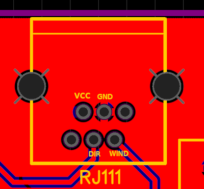

## Vetercek.com weather station WIFI

## Required parts
+ Wemos D1 mini  **5€**
+ Davis 6410 anemometer **150€**
+ DS18B20 water temperature sensor **4€**
+ Waterproof housing
+ Some minor electrical parts like resistors, capacitors, diodes...
  + R1 = 4.7KΩ resistor
  + R2 = 1.8KΩ resistor
  + 1 JCT XH 3p connector for temperature sensor
  + RJ11 connector to PCB
  + 2 cable glands for anemometer cable, and temperature sensor
  + PG11 cable gland with tyvek foil coverig the exit functioning as an air vent

## Scheme
  
Most parts are standard but RJ11 jack is a bit tricky. There are few wariants aveliable. Im using one with part number [5523](http://en.glgnet.biz/productsdetail/productId=97.html) printed on it. Connection should look like this on PCB  
  
Here is the [link](https://easyeda.com/jaka87/wemos-d1) to PCB design.  

## TO-DO
+  test propperly - this is just theoretic design

## Libraries used in this project
+ [ESP8266](https://github.com/esp8266/Arduino) - core library for ESP8266 chip
+ [WiFi Manager](https://github.com/tzapu/WiFiManager) - creates a temporary wifi network to which you connect and enter your wifi credentials
+ [OneWire](https://github.com/PaulStoffregen/OneWire) - manipulate DS18B20 sensor
+ [Arduino-Temperature-Control-Library](https://github.com/milesburton/Arduino-Temperature-Control-Library) - also manipulate DS18B20 sensor
+ [ArduinoJson](https://github.com/bblanchon/ArduinoJson) - parse JSON data

## Thanks!
Thanks to all of you contributing to make this happen. 
Contributing to this software is warmly welcomed. You can use it, change it, do what ever you want with it.

## License
This project is released under
The GNU Lesser General Public License (LGPL-3.0)
